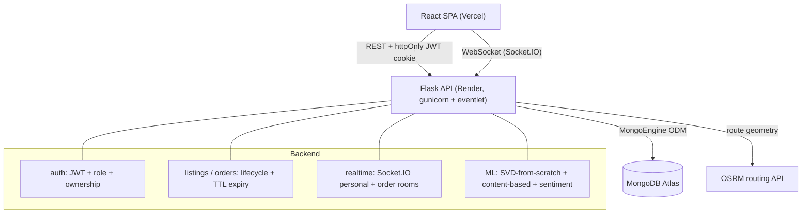

# FoodLink 🍽️

[](https://github.com/owaish7/food-link-app/actions/workflows/ci.yml)

A full-stack platform connecting **restaurants with surplus food** to **NGOs that redistribute it** — turning would-be waste into meals, in real time.

**🔗 Live demo:** https://food-link-app-gold.vercel.app  ·  **API:** https://foodlink-api-22jl.onrender.com

> ⏳ The API is on a free tier that sleeps after ~15 min idle — the **first** request can take ~50s to wake (the app shows a "waking up" indicator). Open it once and it's instant after.

### Try it live
Two demo accounts are seeded (open them in two browsers to see the real-time flow):

| Role | Email | Password |
|------|-------|----------|
| 🍴 Restaurant | `demo.restaurant@foodlink.com` | `Demo@1234` |
| 🤝 NGO / Charity | `demo.ngo@foodlink.com` | `Demo@1234` |

---

## Features

- **Two-sided platform** — restaurants post surplus listings; NGOs discover, request, and receive them.
- **Proximity discovery** — NGOs see nearby restaurants' listings, ranked by location and expiry.
- **Order lifecycle** — request → accept / decline → fulfill / cancel, with listings auto-blocked while in an active order and TTL-based expiry.
- **Hex-code handoff** — the two parties exchange unique codes to confirm the physical pickup, preventing fraudulent order closures.
- **Real-time everything** — Socket.IO pushes new orders and status changes to the other party instantly (no refresh), and powers per-order chat with persisted history.
- **JWT auth + resource-ownership authorization** — every REST and WebSocket endpoint verifies the token and enforces that you can only touch your own resources (see [Security](#security)).
- **ML recommendations** — collaborative filtering via **SVD implemented from scratch** (power iteration, NumPy) over an NGO × food-type matrix, plus content-based filtering.
- **Review sentiment** — a scikit-learn model scores each review positive/negative.
- **Driving directions** — road route between restaurant and NGO with distance + ETA and a suggested midpoint meeting spot, via the OSRM routing API, rendered on a Leaflet map.
- **Modern, responsive UI** — Tailwind design system with light/dark mode, skeleton loaders, toasts, and code-split routes.

## Tech Stack

| Layer     | Tech |
|-----------|------|
| Frontend  | React 18, Vite, Tailwind CSS, React Router, Socket.IO client, Leaflet, axios |
| Backend   | Flask, Flask-SocketIO (eventlet), Flask-MongoEngine, PyJWT, gunicorn |
| Database  | MongoDB (Atlas) |
| ML        | NumPy (SVD from scratch), scikit-learn (review sentiment), matplotlib (analytics) |
| Routing   | OSRM API + geopy |
| Infra     | Vercel (frontend), Render (API), GitHub Actions (CI) |

## Security

Authorization was hardened to close a **Broken Access Control (OWASP #1)** gap:

- **JWT** issued at login, stored in an **httpOnly cookie** (not readable by JS → mitigates XSS token theft).
- A `@require_auth` decorator verifies the token on **every** protected endpoint; `@require_role` gates role-specific actions.
- **Identity always comes from the verified token, never a client-supplied id** — an `owns()` helper enforces resource ownership, so you can't read or mutate another org's listings/orders even with a valid token.
- **Socket.IO is authenticated too** — the handshake verifies the same JWT, chat `sender` is derived from the token, and only the two parties of an order can join its room.

## Architecture



## Local Development

### Backend
```bash
cd server
python -m venv venv
source venv/bin/activate          # Windows: venv\Scripts\activate
pip install -r requirements.txt
cp .env.example .env              # then edit .env
python app.py                     # http://localhost:8800
```
No MongoDB installed? Set `USE_MOCK_DB=1` in `.env` to run against an in-memory database (this is how the tests run).

### Frontend
```bash
cd client
npm install
cp .env.example .env              # set VITE_API_URL=http://localhost:8800
npm run dev                       # http://localhost:5173
```

## Testing & CI

With the backend running (`USE_MOCK_DB=1`):
```bash
cd server
python tests/test_authz.py        # 10 authorization checks
python tests/test_e2e.py          # 26 end-to-end checks
```
[GitHub Actions](.github/workflows/ci.yml) runs both suites **and** the client build on every push / PR to `main`.

## Deployment (free tier)

1. **MongoDB Atlas** — create a free M0 cluster, add a DB user, allow network access from `0.0.0.0/0`, copy the connection string.
2. **Render** — New → Blueprint → this repo (reads `render.yaml`). Set `MONGO_URI` (Atlas string) and `CLIENT_ORIGIN` (your Vercel URL).
3. **Vercel** — import this repo, set **Root Directory** to `client`, add `VITE_API_URL` = your Render API URL.

## Team

Built at IIITDM Jabalpur by Mohammad Owais, Nikhil Chaudhary, Ojasva Tomar, and Nihal Mohammad Ali.
